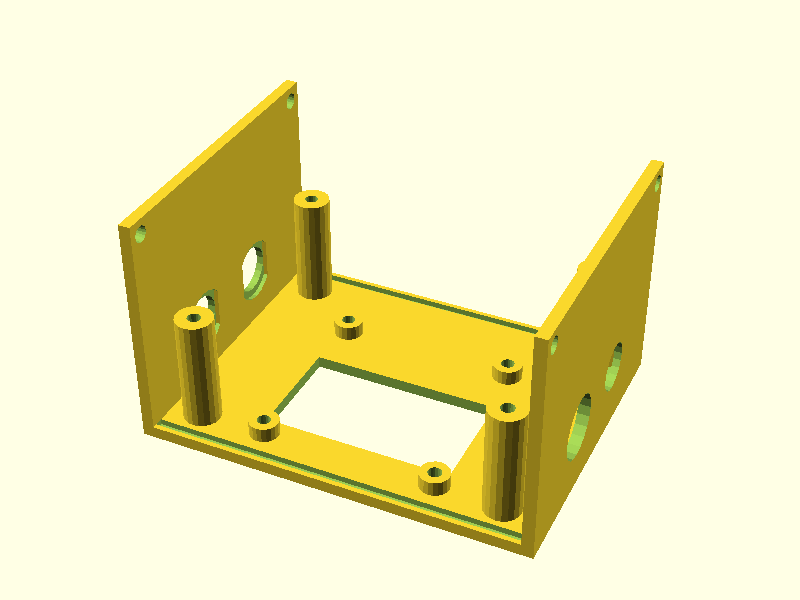

# Hardware

The db-synth hardware consists of a single PCB carrying an AVR DB series microcontroller in a DIP-28 package, a MIDI interface with optocoupler isolation, an analog signal output path using the on-chip DAC and opamps, and connectors for power, OLED display, and programming.

## Overview

| Field | Value |
|-------|-------|
| MCU | AVR128DB28 or AVR64DB28 (AVR, 24 MHz) |
| Audio output | Internal 10-bit DAC, 48 kHz sample rate, 2.5V VREF |
| Signal conditioning | 2 internal opamps (unity gain buffer + 2nd-order reconstruction filter) |
| MIDI | Standard MIDI (31250 baud), optocoupler-isolated input (6N137), thru output |
| Display | SSD1306 OLED, I2C (address `0x3C`) |
| Power | 5V DC via JST XH connector |
| PCB size | ~47 mm x 37 mm |
| PCB revision | 20240111 |
| License | Firmware: BSD-3-Clause, Hardware: CERN-OHL-S-2.0 |

## PCB

PCB top render

PCB bottom render

**Resources:**

- [Schematic (PDF)](@@/p/db-synth/kicad/db-synth_20240111_sch.pdf)
- [Interactive BOM](@@/p/db-synth/kicad/db-synth_20240111_ibom.html)
- [Gerber files (ZIP)](@@/p/db-synth/kicad/db-synth_20240111_gerber.zip)

KiCad source files are available in the repository under `pcb/`.

### Connectors

All external connections use JST XH connectors, except for the UPDI programming header (standard 2.54 mm pin header) and the OLED display (2.54 mm pin socket).

| Connector | Type | Function |
|-----------|------|----------|
| J1 | Pin Header 1x3 | UPDI programming |
| J2 | JST XH 2P | Reset |
| J3 | Pin Socket 1x4 | OLED display (I2C) |
| J4 | JST XH 2P | Power (5V) |
| J5 | JST XH 2P | MIDI IN |
| J6 | JST XH 3P | MIDI OUT/THRU |
| J7 | JST XH 2P | Audio OUT |

### MCU selection

The PCB schematic references the AVR64DB28, but the AVR128DB28 is pin-compatible and also supported. The MCU must be selected at firmware build time via the `WITH_MCU` CMake option. Both variants are available in SPDIP-28 (DIP) package, making them easy to hand-solder or socket.

## Enclosure

A 3D-printable enclosure designed in OpenSCAD is available. It consists of a front panel (with the OLED display cutout) and a back panel (with cutouts for the audio jack and MIDI connectors).

Enclosure front panel

Enclosure back panel

| Part | File |
|------|------|
| Front panel | `enclosure-front.stl` |
| Back panel | `enclosure-back.stl` |

Source files are available in the repository under `3d-models/`.

## Build manual

For general assembly instructions -- including PCB ordering, parts sourcing, soldering, and UPDI flashing -- refer to the [Hardware Build Manual](@@/hardware/build-manual/).

The board is primarily PTH components. The only IC that requires special attention is the 6N137 optocoupler (DIP-8). Consult the [Interactive BOM](@@/p/db-synth/kicad/db-synth_20240111_ibom.html) and the [Schematic (PDF)](@@/p/db-synth/kicad/db-synth_20240111_sch.pdf) for component placement and values.

- For firmware building and flashing instructions, see [Firmware](20_firmware.md).
- For the complete MIDI implementation chart, see [MIDI implementation](30_midi.md).
